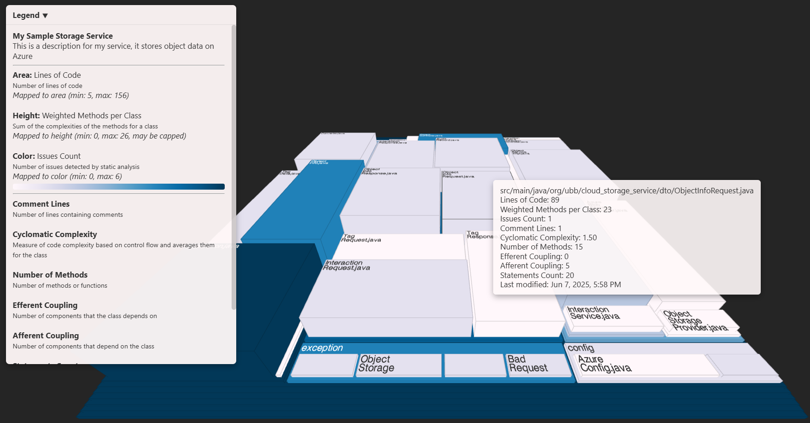
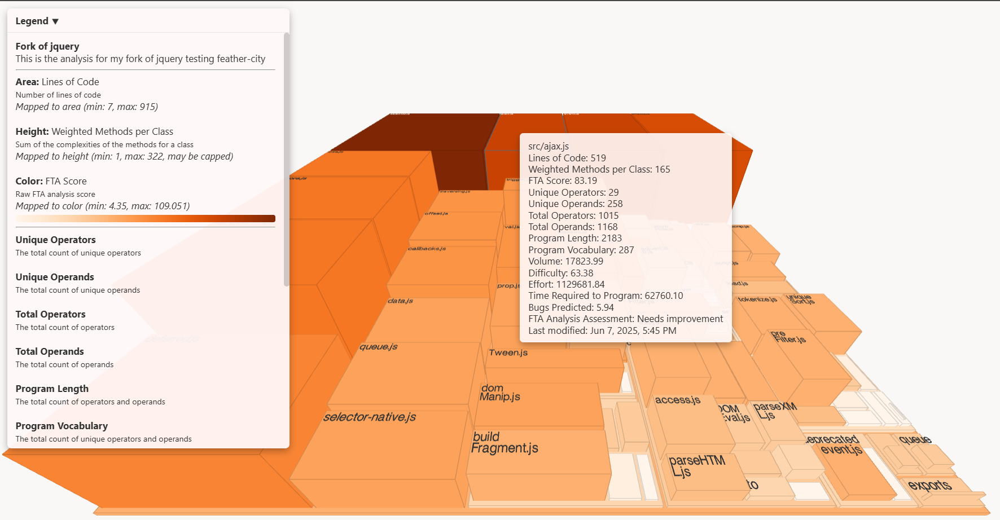
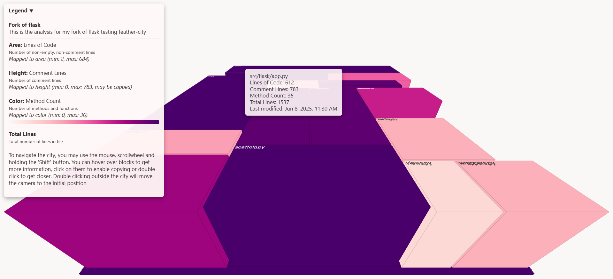

# Feather City Analysis Action

This GitHub Action analyses Java, TypeScript / JavaScript and Python projects using Feather City and generates 3D HTML visualizations of a "software map" that can be explored to find anomalous classes.

## Features

- Analyses Java , TypeScript / JavaScript and Python source code with various metrics (Lines of Code, Cyclomatic Complexity, Number of Methods, etc.)
- Uses [PMD](https://pmd.github.io/) for Java issue analysis and [fta-cli](https://ftaproject.dev/) for TypeScript / JavaScript metrics analysis
- Generates HTML visualizations for better code understanding
- Customizable analysis parameters, themes and metrics
- Overall quick (<30s for projects up to 5-10K lines of code)

## Usage

### Basic Usage

Add this to your GitHub workflow file (e.g., `.github/workflows/feather-city.yml`):

```yaml
name: Analyse with Feather City
on:
  push:
    branches: [ main ]
  workflow_dispatch:  # Allow manual triggering

jobs:
  analyse:
    runs-on: ubuntu-latest
    steps:
      - uses: actions/checkout@v4
      - name: Run Feather City Analysis
        uses: livcristi/feather-city-action/java@v0 # or livcristi/feather-city-action/typescript@v0 for ts / js projects and livcristi/feather-city-action/python@v0 for python projects
```

### Advanced Usage

You can customize the analysis by specifying input parameters:

```yaml
name: Java Analysis with Feather City
on:
  push:
    branches: [ main ]
  workflow_dispatch: # Allow manual triggering

jobs:  
  analyse:  
    runs-on: ubuntu-latest  
    steps:  
      - uses: actions/checkout@v4   
      - name: Run Feather City Analysis  
        uses: livcristi/feather-city-action/java@v0
        with:  
          input_dir: './src'  
          metrics: 'loc,wmc,iss,cloc,cc,nom,ce,ca,stat'  
          title: "My Service"  
          project_description: "This is a description for my service"  
          theme: 'light'  
          java_version: '8'  
          pmd_version: '7.13.0'  
          feather_city_version: '0.1.2'  
          color_palette: "magma"
```

```yaml
name: TypeScript / JavaScript Analysis with Feather City
on:
  push:
    branches: [ main ]
  workflow_dispatch: # Allow manual triggering

jobs:  
  analyse:  
    runs-on: ubuntu-latest  
    steps:  
      - uses: actions/checkout@v4   
      - name: Run Feather City Analysis
        uses: livcristi/feather-city-action/typescript@v0
        with:
          input_dir: './src'
          metrics: 'line_count,cyclo,fta_score,uniq_operators'
          title: "My Service"
          project_description: "This is the description for my service"
          theme: 'light'
          java_version: '8'  
          pmd_version: '7.13.0'  
          feather_city_version: '0.1.2'  
          color_palette: "magma"
```

```yaml
name: Python Analysis with Feather City
on:
  push:
    branches: [ main ]
  workflow_dispatch: # Allow manual triggering

jobs:  
  analyse:  
    runs-on: ubuntu-latest  
    steps:  
      - uses: actions/checkout@v4   
      - name: Run Feather City Analysis
        uses: livcristi/feather-city-action/python@v0
        with:
          input_dir: './src'
          metrics: 'loc,cloc,nom,tloc'
          title: "My Service"
          project_description: "This is the description for my service"
          theme: 'light'
          java_version: '8'  
          pmd_version: '7.13.0'  
          feather_city_version: '0.1.2'  
          color_palette: "magma"
```
## Example for Visualisations

Java project visualisation: 

TypeScript project (jQuery) visualisation: 

Python project (Flask) visualisation: 
## Inputs

### Java inputs

| Input                   | Description                                           | Required | Default         |
| ----------------------- | ----------------------------------------------------- | -------- | --------------- |
| `input_dir`             | Directory containing Java source files                | No       | `./src`         |
| `title`                 | The title for the visualisation                       | No       | empty           |
| `description`           | Description of the project for the visualisation      | No       | empty           |
| `metrics`               | Comma-separated list of metrics (e.g., loc,cc,mi)     | No       | all of them     |
| `pmd_rulesets`          | Comma-separated list of pmd rulesets                  | No       | see action code |
| `exclude_directories`   | Comma-separated list of directory names to exclude    | No       | empty           |
| `exclude_filenames`     | Comma-separated list of file name patterns to exclude | No       | empty           |
| `output_dir`            | Output directory for visualization results            | No       | `.visual`       |
| `theme`                 | Visualization theme (light or dark)                   | No       | `light`         |
| `color_palette`         | Color palette (eg: puBu, magma, oranges)              | No       | `puBu`          |
| `treemap_algorithm`     | The treemap algorithm to be used                      | No       | `squarify`      |
| `map_width`             | The city map width                                    | No       | `1000`          |
| `map_depth`             | The city map depth                                    | No       | `1060`          |
| `max_height`            | The maximum height for the city blocks                | No       | `200`           |
| `show_legend`           | Whether to show the legend or not                     | No       | `true`          |
| `show_dependency_lines` | Whether to show the dependency lines or not           | No       | `false`         |
| `pmd_version`           | PMD version to use                                    | No       | `7.13.0`        |
| `feather_city_version`  | Feather City version to use                           | No       | latest one      |

### TypeScript / JavaScript inputs

| Input                   | Description                                                        | Required | Default     |
| ----------------------- | ------------------------------------------------------------------ | -------- | ----------- |
| `input_dir`             | Directory containing Java source files                             | No       | `./src`     |
| `title`                 | The title for the visualisation                                    | No       | empty       |
| `description`           | Description of the project for the visualisation                   | No       | empty       |
| `metrics`               | Comma-separated list of metrics (e.g., line_count,cyclo,fta_score) | No       | all of them |
| `score_cap`             | Score cap for the fta analysis                                     | No       | 10000       |
| `node_version`          | Node.js version to use for fta-cli                                 | No       | `18`        |
| `fta_cli_version`       | fta-cli version to install and run                                 | No       | `2.0.1`     |
| `exclude_directories`   | Comma-separated list of directory names to exclude                 | No       | empty       |
| `exclude_filenames`     | Comma-separated list of file name patterns to exclude              | No       | empty       |
| `output_dir`            | Output directory for visualization results                         | No       | `.visual`   |
| `theme`                 | Visualization theme (light or dark)                                | No       | `light`     |
| `color_palette`         | Color palette (eg: puBu, magma, oranges)                           | No       | `puBu`      |
| `treemap_algorithm`     | The treemap algorithm to be used                                   | No       | `squarify`  |
| `map_width`             | The city map width                                                 | No       | `1000`      |
| `map_depth`             | The city map depth                                                 | No       | `1060`      |
| `max_height`            | The maximum height for the city blocks                             | No       | `200`       |
| `show_legend`           | Whether to show the legend or not                                  | No       | `true`      |
| `show_dependency_lines` | Whether to show the dependency lines or not                        | No       | `false`     |
| `feather_city_version`  | Feather City version to use                                        | No       | latest one  |

### Python inputs

| Input                   | Description                                           | Required | Default     |
| ----------------------- | ----------------------------------------------------- | -------- | ----------- |
| `input_dir`             | Directory containing Java source files                | No       | `./src`     |
| `title`                 | The title for the visualisation                       | No       | empty       |
| `description`           | Description of the project for the visualisation      | No       | empty       |
| `metrics`               | Comma-separated list of metrics (e.g., loc,cloc,nom)  | No       | all of them |
| `exclude_directories`   | Comma-separated list of directory names to exclude    | No       | empty       |
| `exclude_filenames`     | Comma-separated list of file name patterns to exclude | No       | empty       |
| `output_dir`            | Output directory for visualization results            | No       | `.visual`   |
| `theme`                 | Visualization theme (light or dark)                   | No       | `light`     |
| `color_palette`         | Color palette (eg: puBu, magma, oranges)              | No       | `puBu`      |
| `treemap_algorithm`     | The treemap algorithm to be used                      | No       | `squarify`  |
| `map_width`             | The city map width                                    | No       | `1000`      |
| `map_depth`             | The city map depth                                    | No       | `1060`      |
| `max_height`            | The maximum height for the city blocks                | No       | `200`       |
| `show_legend`           | Whether to show the legend or not                     | No       | `true`      |
| `show_dependency_lines` | Whether to show the dependency lines or not           | No       | `false`     |
| `feather_city_version`  | Feather City version to use                           | No       | latest one  |

## Important Notes

### Dependency Configuration

The action automatically installs PMD for the Java action and fta-cli for the Typescript / JavaScript action and configures it for use with Feather City. No additional setup is required.

### Available Metrics

The following metrics are available for Java projects:

| ID     | Name                       | Description                                                                            |
| ------ | -------------------------- | -------------------------------------------------------------------------------------- |
| `loc`  | Lines of Code              | Number of lines of code                                                                |
| `wmc`  | Weighted Methods per Class | Sum of the complexities of the methods for a class                                     |
| `iss`  | Issues Count               | Number of issues detected by static analysis                                           |
| `cloc` | Comment Lines              | Number of lines containing comments                                                    |
| `cc`   | Cyclomatic Complexity      | Measure of code complexity based on control flow and computes an average for the class |
| `nom`  | Number of Methods          | Number of methods or functions                                                         |
| `stat` | Statements Count           | Number of statements in the class                                                      |
| `ce`   | Efferent Coupling          | Number of components that the class depends on                                         |
| `ca`   | Afferent Coupling          | Number of components that depend on the class                                          |

And the following metrics are available for TypeScript / JavaScript projects:

| ID                | Name                       | Description                                                     |
| ----------------- | -------------------------- | --------------------------------------------------------------- |
| `line_count`      | Lines of Code              | Number of lines of code                                         |
| `cyclo`           | Weighted Methods per Class | Sum of the complexities of the methods for a class              |
| `fta_score`       | FTA Score                  | Raw FTA analysis score                                          |
| `uniq_operators`  | Unique Operators           | The total count of unique operators                             |
| `uniq_operands`   | Unique Operands            | The total count of unique operands                              |
| `total_operators` | Total Operators            | The total count of operators                                    |
| `total_operands`  | Total Operands             | The total count of operands                                     |
| `program_length`  | Program Length             | The total count of operators and operands                       |
| `vocabulary_size` | Program Vocabulary         | The total count of unique operators and operands                |
| `volume`          | Volume                     | A measure of the size of the program                            |
| `difficulty`      | Difficulty                 | Quantifies how difficult a program is to write or understand    |
| `effort`          | Effort                     | An estimation of the amount of work required to write a program |
| `time`            | Time Required to Program   | An estimation of the time required to write the program         |
| `bugs`            | Bugs Predicted             | An estimation of the number of bugs in the program              |
| `assessment`      | FTA Analysis Assessment    | A hint based on the FTA score                                   |

And the following metrics are available for Python projects

| ID     | Name          | Description                            |
| ------ | ------------- | -------------------------------------- |
| `loc`  | Lines of Code | Number of non-empty, non-comment lines |
| `cloc` | Comment Lines | Number of comment lines                |
| `nom`  | Method Count  | Number of methods and functions        |
| `tloc` | Total Lines   | Total number of lines in a file        |

### Color Palette

The color palettes are taken from [d3 sequential schemes](https://d3js.org/d3-scale-chromatic/sequential) and can be copied from there. Some recommended examples are:
- [puBu](https://d3js.org/d3-scale-chromatic/sequential#interpolatePuBu)
- [oranges](https://d3js.org/d3-scale-chromatic/sequential#interpolateOranges)
- [inferno](https://d3js.org/d3-scale-chromatic/sequential#interpolateInferno)
- [magma](https://d3js.org/d3-scale-chromatic/sequential#interpolateMagma)
- [rdPu](https://d3js.org/d3-scale-chromatic/sequential#interpolateRdPu)

For accessibility reasons, we suggest you to use color palettes that are also distinguishable for people with visual impairments.
## License

This project has an [MIT License](LICENSE) for it and is currently only a research helper for my Master's thesis. 

There is a special license associated with PMD (see [THIRD-PARTY-LICENSES](THIRD-PARTY-LICENSES)) which we also included in the project, since it uses PMD for the Java analysis, so be mindful of it.